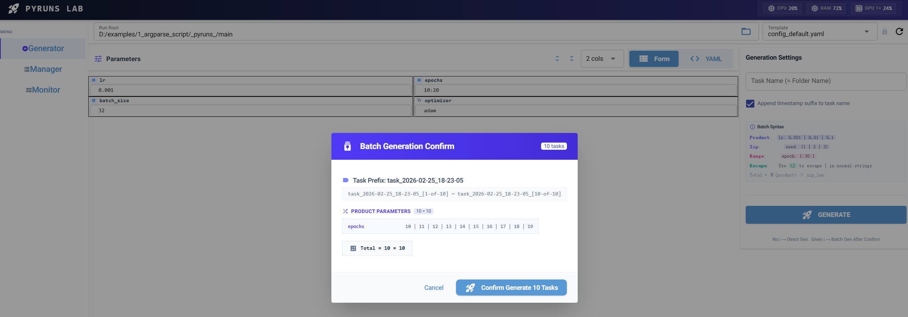
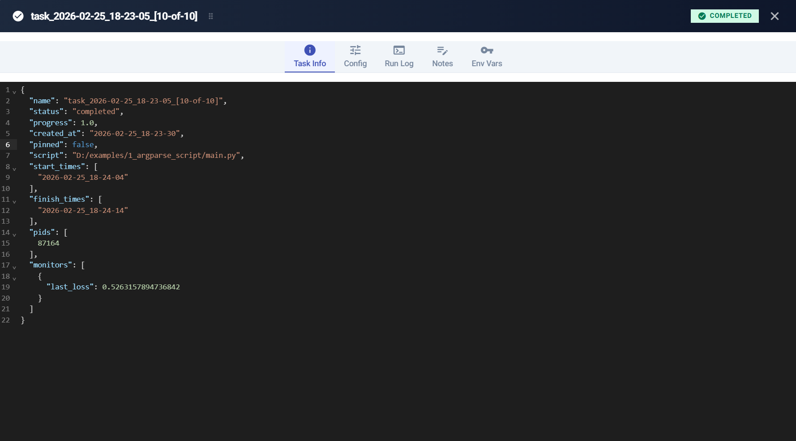
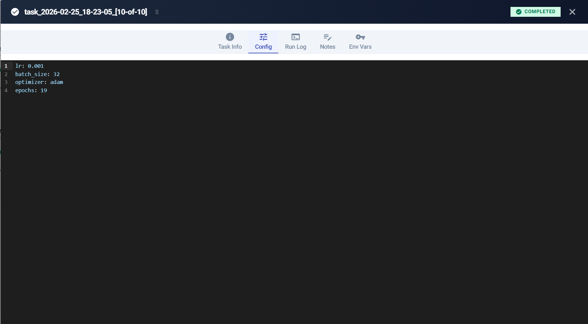
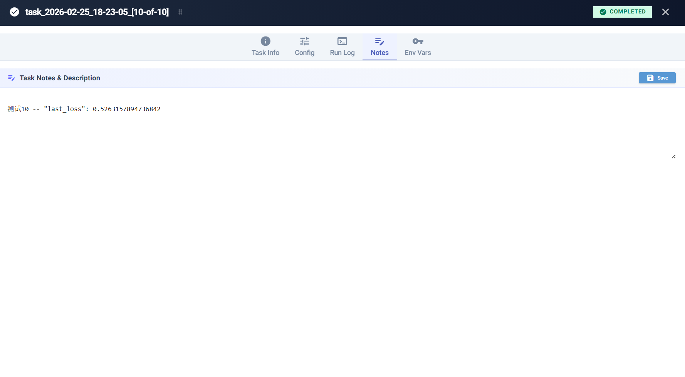
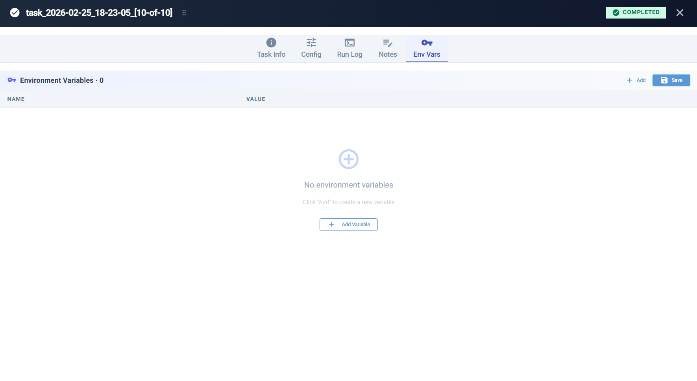
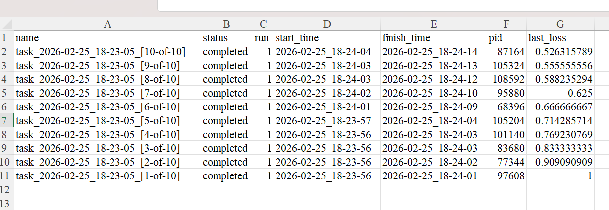

# Pyruns

**English | [简体中文](README.md)**

<p align="center">
  
  
  
</p>

<p align="center">
  <b>Lightweight Python experiment management Web UI — configure, batch-run, and monitor in one place 🚀</b>
</p>

Pyruns gives your Python scripts a **zero-config** browser interface: it auto-parses `argparse` definitions into a visual form, expands parameter grids with built-in syntax, schedules parallel execution, streams ANSI-colored logs in real time, and exports cross-task metric reports.

**No changes to your code required.**

```bash
pip install pyruns
pyr train.py          # that's it
```

---

## ✨ Key Features

| Feature | Description |
|---------|-------------|
| 🔌 **Zero-Code Integration** | Auto-parses `argparse` definitions into a web form. Also supports YAML/JSON config import |
| 🧮 **Batch Parameter Grid** | `lr: 0.001 \| 0.01 \| 0.1` — one-line declaration, auto-expands to Cartesian product or paired combinations |
| ⚡ **Parallel Execution** | Built-in task queue + thread/process worker pool with configurable concurrency |
| 📋 **Full Task Lifecycle** | Card-based dashboard: status filter, search, pin, notes, env vars, config snapshots, run logs |
| 🖥️ **Live Colored Terminal** | Stream ANSI-colored stdout to the browser (supports `tqdm`, `colorama`), incremental push |
| 📊 **Metrics & Export** | Call `pyruns.add_monitor(loss=0.23)` in your script, aggregate across tasks, export CSV/JSON |
| 💻 **System Resource Panel** | Real-time CPU / RAM / multi-GPU utilization in the header bar |
| 📁 **Workspace Isolation** | Auto-isolated by script name (`_pyruns_/train/` vs `_pyruns_/test/`), soft-delete with recovery |

---

## 🚀 Quick Start

### Mode 1: Argparse Scripts (Zero Config)

No code changes needed. Pyruns uses AST analysis to extract `argparse` parameters and generate the UI.

```bash
pyr train.py
```

On first run, Pyruns creates `_pyruns_/train/config_default.yaml` (containing all default values) and launches the Web UI.

### Mode 2: Custom YAML Config

For scripts using `pyruns.load()`, pass a YAML file on first run:

```bash
pyr train.py my_config.yaml   # → copied to _pyruns_/train/config_default.yaml
```

Subsequent runs load the saved config automatically:

```bash
pyr train.py                   # → auto-loads _pyruns_/train/config_default.yaml
```

> Pass a new YAML anytime to overwrite the default template.

```bash
pyr help      # CLI help
pyr version   # check version
```

---

## 🎯 Feature Overview

### 🔧 Generator — Configure & Batch Tasks

Load a parameter template, edit in a structured form or YAML editor. Use batch syntax to generate parameter search grids in one click.



> When parsing `argparse`, if both short and long flags exist (e.g., `-b, --batch_size`), the long name is used as the config key.

### 📦 Manager — Task Console

Card grid displaying all tasks. Filter by status, fuzzy search, bulk-select and run. Click a card for full metadata:


| | |
|:---:|:---:|
| **Task Info Overview**<br> | **Config Snapshot**<br> |
| **Custom Notes**<br> | **Environment Sandbox**<br> |

### 📈 Monitor — Live Logs & Metric Export

Real-time ANSI-colored terminal output in the browser. The header bar continuously shows CPU / RAM / GPU metrics.


Record evaluation metrics with `pyruns.add_monitor()` and export aggregated CSV/JSON reports across tasks:

```python
pyruns.add_monitor(last_loss=last_loss)
```



---

## 🧪 Batch Generation Syntax

Use pipe syntax directly in the Generator page for parameter grid search.


**Cartesian Product `|`** — full combination (3 × 2 = 6 tasks):
```yaml
learning_rate: 0.001 | 0.01 | 0.1
batch_size: 32 | 64
```

**Paired Zip `(|)`** — positional mapping (3 tasks):
```yaml
seed: (1 | 2 | 3)
experiment_name: (exp_a | exp_b | exp_c)
```

Both can be mixed. See [Batch Syntax Guide](docs/batch-syntax.md) for details.

---

## 📂 Workspace Structure

On first run, `pyr train.py` creates the following structure:

```text
your_project/
├── train.py
└── _pyruns_/
    ├── _pyruns_settings.yaml      # Global settings (port, concurrency, etc.)
    └── train/                     # Isolated per script name
        ├── config_default.yaml    # Parameter template (auto-generated or imported)
        └── tasks/
            ├── my-exp-[1-of-6]/
            │   ├── task_info.json # Metadata (status, timestamps, PID, notes, etc.)
            │   ├── config.yaml    # Parameter snapshot for this run
            │   └── run_logs/
            │       └── run1.log   # Console output
            └── .trash/            # Soft-deleted tasks (recoverable)
```


Different scripts are fully isolated (`_pyruns_/train/` and `_pyruns_/test/` never interfere).

Customize via `_pyruns_settings.yaml`:

```yaml
ui_port: 8099                      # Web UI port
generator_form_columns: 2          # Form column count
manager_max_workers: 4             # Max concurrent workers
manager_execution_mode: thread     # Execution mode: thread | process
log_enabled: false                 # Debug logging
```

---

## 📖 Documentation

| Document | Description |
|----------|-------------|
| [📗 Getting Started](docs/getting-started.md) | 5-minute setup walkthrough |
| [📙 Configuration](docs/configuration.md) | `_pyruns_` directory structure, config priority, type inference |
| [📘 Batch Syntax](docs/batch-syntax.md) | Cartesian product / paired zip / nested parameter expansion |
| [📕 UI Guide](docs/ui-guide.md) | Detailed Generator, Manager, Monitor operations |
| [📓 API Reference](docs/api-reference.md) | `read()` / `load()` / `add_monitor()` and utility functions |
| [📒 Architecture](docs/architecture.md) | Three-layer design, data flow, scheduling (for contributors) |

---

## License

MIT
