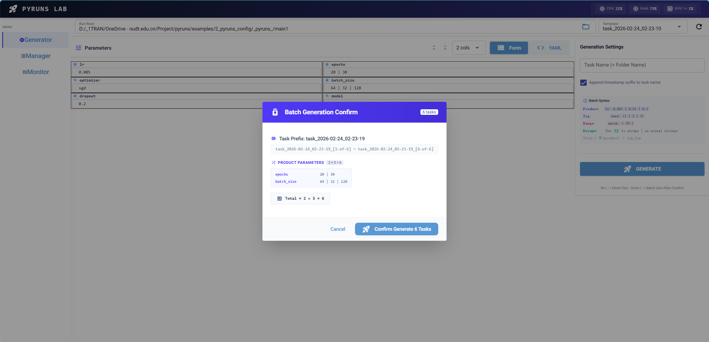
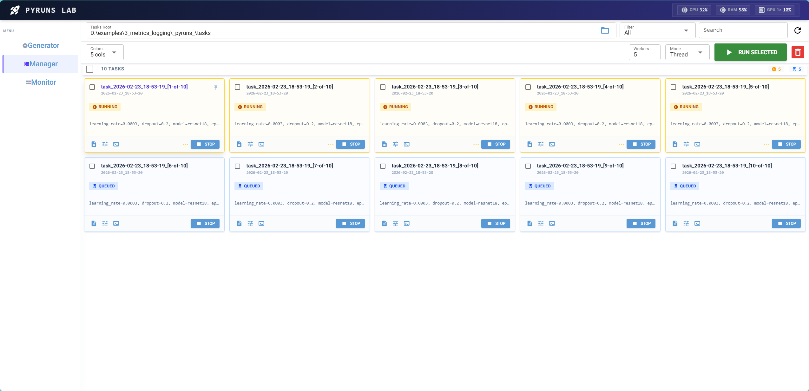
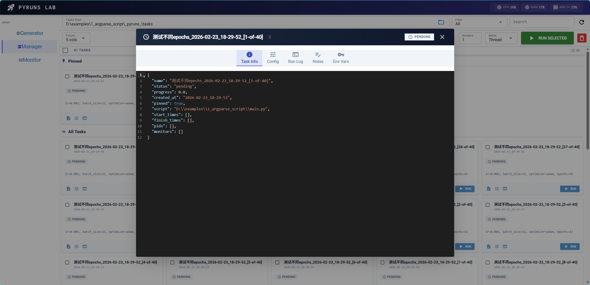
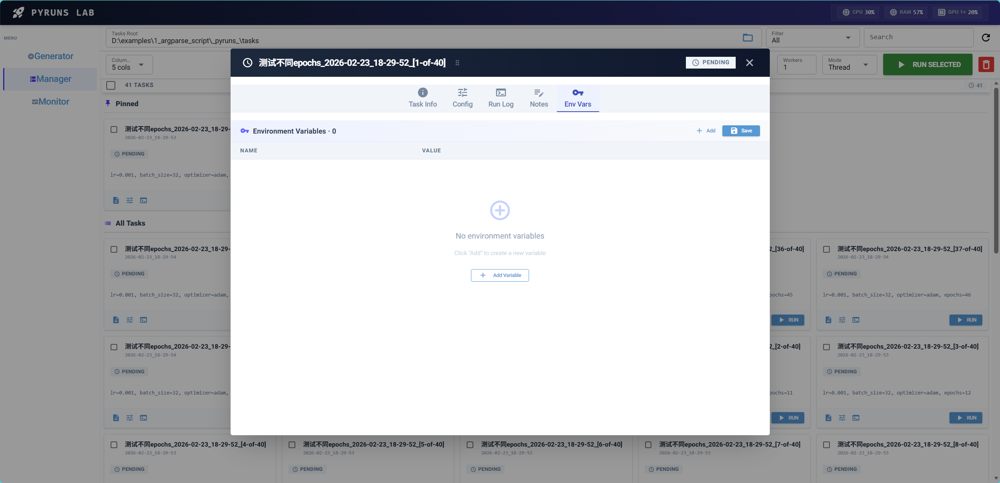

# Pyruns — Python Experiment UI

**English | [简体中文](README.md)**

<p align="center">
  
  
  
</p>

<p align="center">
  <b>🧪 A lightweight, minimalist web UI for managing, running, and monitoring your Python experiments.</b><br>
  <i>No complex configuration. Plug and play to make hyperparameter tuning elegant and efficient for ML and scientific computing.</i>
</p>

---

## 📦 Installation

```bash
pip install pyruns
```

**Requirements:** Python ≥ 3.8.  
**Dependencies:** *NiceGUI, PyYAML, psutil*.

---

## 🚀 Quick Start

No need to rewrite your code! Pyruns works out of the box with your existing `argparse` scripts.

### CLI Usage

```bash
# Mode 1: Zero Config (Automatically parses your Argparse script to build UI)
pyr train.py

# Mode 2: Custom YAML Config (Imports your YAML as the base config for this script)
pyr train.py my_config.yaml

# Helper commands
pyr help
pyr version
```


---

## ✨ Features & UI Showcases

We have provided an `examples/` directory to help you get started quickly. Pyruns provides three main tabs to manage the full lifecycle of your python experiments.

### 1. Generator: Configure & Batch Tasks

Load YAML configs or parse `argparse`, edit hyperparameters in a structured auto-generated form, and utilize powerful **batch generation syntax** to queue up hundreds of experiments instantly!



**Basic Usage: Argparse (No Code Changes)**
See `examples/1_argparse_script/main.py`. Pyruns will automatically read your `argparse` definitions and build the Generator UI for you.
> 💡 **Tip**: When both short and long arguments are defined (e.g., `-b, --batch_size`), Pyruns intelligently prioritizes the long argument name as the configuration key!

### 2. Manager: Task Grid & Parallel Bulk Run

A clean, card-grid overview of all your generated tasks. Filter by status, search by name, bulk-select your experiments, and utilize background worker pools to run them in parallel!



View detailed task configurations at a glance:






### 3. Monitor: Live Colored Logs & Metrics Logging

Click into any running task to directly view real-time **ANSI-colored terminal logs** in your browser!
Use `pyruns.add_monitor()` in your scripts to record training metrics, making it easy to export bulk CSV/JSON reports later.


**Advanced Usage: Logging Final Metrics**
See `examples/3_metrics_logging/train.py`. Just add one line of code after training:

```python
import pyruns

# Your training loop...
loss, accuracy = 0.2, 0.95

# Track the final metrics for this run to easily export bulk CSV/JSON reports later
pyruns.add_monitor(loss=loss, accuracy=accuracy)
```

---

## 📋 Batch Generation Syntax

You can queue up massive grids of experiments directly within the Generator form.


**Product (Cartesian) `|`**  
Will create $3 \times 2 = 6$ combinations.
```yaml
learning_rate: 0.001 | 0.01 | 0.1
batch_size: 32 | 64
```

**Zip (Paired) `(|)`**  
Must have matching lengths. Will create exactly 3 combinations.
```yaml
seed: (1 | 2 | 3)
experiment_name: (exp_a | exp_b | exp_c)
```

---

## ⚙️ Workspace Configuration `_pyruns_`

Upon launch, `pyr train.py` will automatically create a unified `_pyruns_` workspace directory alongside your script.
Global UI settings are shared in `_pyruns_/_pyruns_settings.yaml`, while each script gets its own isolated sub-namespace (e.g., `_pyruns_/train/config_default.yaml` and `_pyruns_/train/tasks/`), completely eliminating config conflicts between multiple scripts!


You can also explicitly import your own YAML as the initial config via CLI:
```bash
# Automatically copies my_config.yaml to _pyruns_/train/config_default.yaml
pyr train.py my_config.yaml
```

You can edit the shared settings (`_pyruns_/_pyruns_settings.yaml`) to deeply customize your UI experience:!
```yaml
ui_port: 8099                      # Web UI port
generator_form_columns: 2          # Grid columns in generator form
manager_max_workers: 4             # Number of scripts to run in parallel
manager_execution_mode: thread     # Run using threads or processes
log_enabled: false                 # Enable file logging
```

---

## 📚 Detailed Documentation

Want to unlock Pyruns' full potential? Check out our official documentation:

- 🚀 [Getting Started](docs/getting-started.md) — 5-minute setup guide
- ⚙️ [Configuration Guide](docs/configuration.md) — Understanding `_pyruns_` structure and settings
- 🧪 [Batch Syntax](docs/batch-syntax.md) — Deep dive into Product / Zip generation
- 🖥️ [UI User Guide](docs/ui-guide.md) — Mastering Generator, Manager, and Monitor pages
- 🛠️ [API Reference](docs/api-reference.md) — Deep integration within your scripts
- 📐 [Architecture](docs/architecture.md) — Internal design and principles

---

## 📄 License
MIT License.
