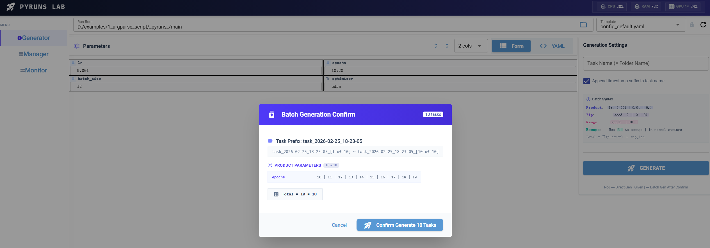
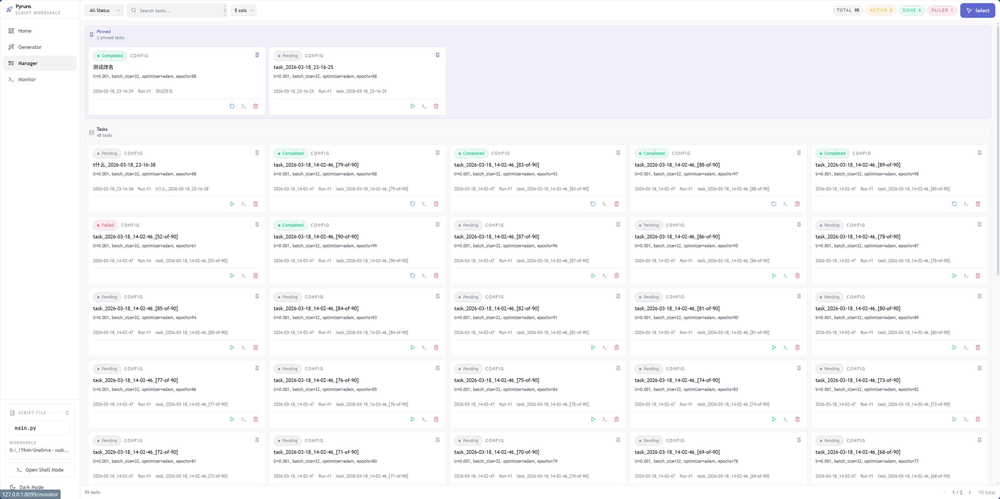
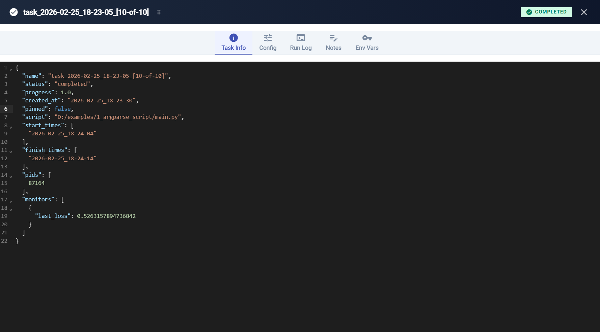
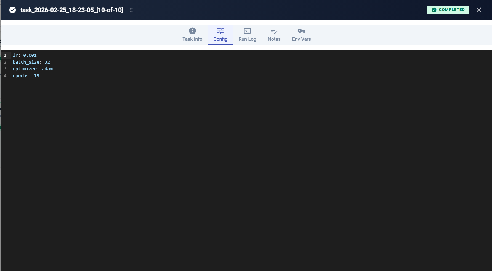
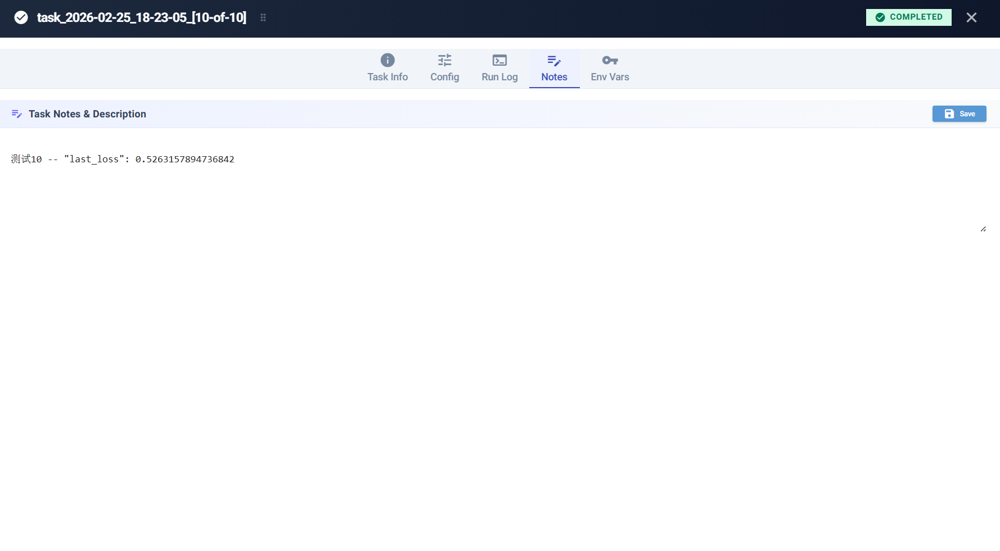
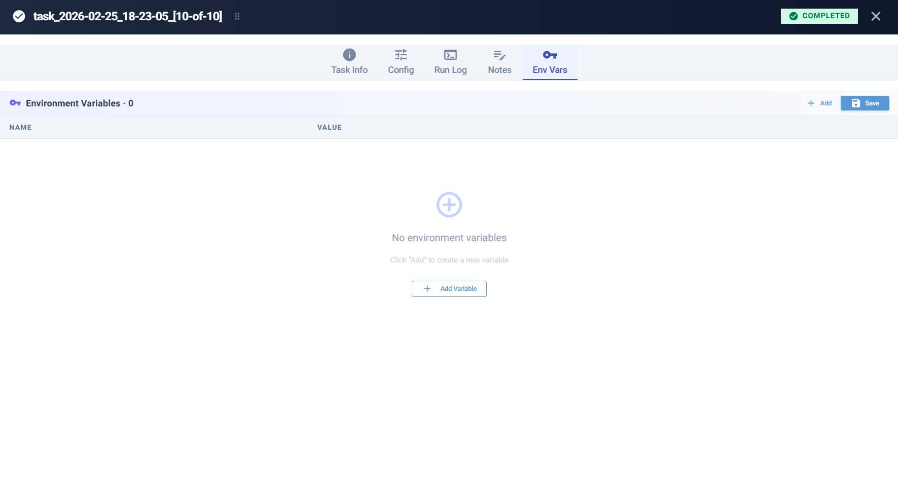
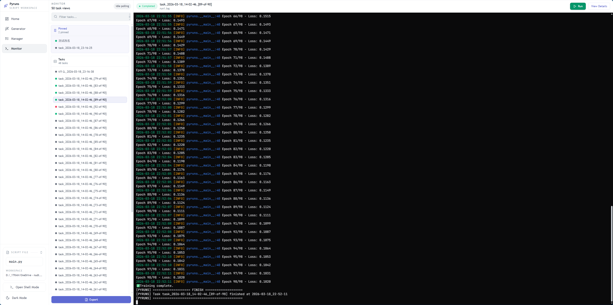

# Pyruns

**English | [简体中文](README.md)**

<p align="center">
  
  
  
</p>

<p align="center">
  <b>Python experiment management Web UI: parameter visualization, batch scheduling, and resource monitoring</b>
</p>

Pyruns provides a local browser-based graphical interface for Python scripts. Its main features include generating visual configuration forms by parsing `argparse`, supporting specific syntax to implement batch task generation on parameter grids, managing parallel scheduling queues, providing real-time stream output of ANSI-colored logs, and exporting aggregated cross-task metrics.

**This tool does not require modification of native business code, and all processes are executed locally.**

```bash
pip install pyruns
pyr train.py          # Launch Web UI and proxy the current script
```

---

## 💡 Engineering Challenges Addressed

During standard model training workflows, modifying and tracking different parameter combinations is often extremely tedious and error-prone:
- Writing multi-layered nested Bash loop scripts for hyperparameter search is verbose and hard to maintain.
- Manually recording each parameter set and its corresponding experimental result is time-consuming and easily lost or confused over time.
- During concurrent execution with multiple parameters, standard output logs interleave, hindering error localization.

**Pyruns' core solution is designed to make the cumbersome process of "parameter modification and experiment tracking" incredibly simple:**
- ✅ **Minimalist Task Generation**: Non-invasively parses existing `argparse` and provides a **concise, clearly visible Web UI parameter editor**. It supports declarative syntax (e.g., `lr: 0.001 | 0.01`) to expand parameter grids and generate isolated tasks with one click.
- ✅ **Convenient Historical Task Management**: You can easily track, search, reuse, and manage the status of previously run experimental tasks.
- ✅ **Real-time Isolated Log Viewing**: No need to worry about tasks being interrupted by SSH terminal disconnections. While tasks are running, you can view isolated standard outputs and error stacks for each task in real-time right in your browser.
- ✅ **Variable Monitoring & One-Click Report Export**: Provides a simple API to monitor key metrics during task execution. It supports cross-task metric comparison on the frontend and allows you to merge and export comprehensive reports with a single click.

---

## ✨ Core Features

| Feature | Description |
|---------|-------------|
| 🔌 **Static Parameter Parsing** | Extracts definitions of `argparse` from the source code to render the Web UI form; direct config through `yaml` files is also supported. |
| 🧮 **Parameter Grid Expansion** | Supports building batch parameter configurations utilizing `\|` for Cartesian product permutations or `(\|)` for paired mappings. |
| ⚡ **Isolated Task Queues** | Implements a buffer queue with configurable Thread/Process pool executors for execution limits. |
| 📋 **Status Dashboard** | Manages the progression (Pending/Running/Failed/Completed) and provides historical query/rerun functions. |
| 🖥️ **Stream Colored Terminal** | Delivers incremental terminal output feeds fully supporting ANSI escape code rendering (e.g., `tqdm`). |
| 📊 **Metrics Aggregator** | Affords `pyruns.record()` callback to consolidate logs from various experimental groups into CSV/JSON logs. |
| 📁 **Parameter Snapshots** | Configures runtime directories corresponding to the file topology within `_pyruns/`, storing current environments to mitigate cross-interference, equipped with a soft-deletion mechanism for safety. |

---

## 🚀 Getting Started

### Mode 1: Argparse Based Script Integration

No source code modification is needed. Pyruns employs an AST analyzer to extract the configurations of `add_argument`.

```bash
pyr train.py
```
This generates `_pyruns_/train/config_default.yaml` in the directory associated with the script, followed by starting a local Web service (listening on port `8099` by default).

### Mode 2: Loading Base YAML Configuration

If your script functions by reading external YAML configurations and incorporates `pyruns.load()` within the source logic:

```bash
# Initial execution: Supply default parameter template
pyr train.py my_config.yaml  
```
Pyruns then administers parameter management and associated environment variables:

```bash
pyr train.py
```

### Mode 3: CLI Interactive Mode

If you are running on a Headless Server or prefer a pure command-line experience, Pyruns also offers a **first-class CLI interactive environment that is fully equivalent to the Web UI**.

```bash
pyr cli train.py
```

This command automatically initializes the exact same workspace directory structure and configuration as the Web UI, and drops you into an interactive REPL terminal:
```text
  Pyruns CLI  (type 'help' for commands, 'exit' to quit)
pyruns> ls         # List current tasks
pyruns> run 1      # Run a task and automatically stream standard output!
pyruns> status -i  # Real-time system and GPU metrics
```
All actions triggered via the CLI are 100% data-compatible and synchronized with the Web UI.

---

## 📝 Practical Examples

Runnable example scripts corresponding to these two modes are provided under the `examples/` directory in our repository.

### Example 1: Native Argparse Support (Zero-Code Change)

> Directory: `examples/1_argparse_script/`

Below is a standard `argparse` training script. You can seamlessly hand it over to Pyruns—**without making a single modification to your codebase**:

```python
# examples/1_argparse_script/main.py
import pyruns
import argparse
import time

def main():
    parser = argparse.ArgumentParser(description="A simple ML training script.")
    parser.add_argument("--lr", type=float, default=0.001, help="Learning rate")
    parser.add_argument("--epochs", type=int, default=10, help="Number of training epochs")
    parser.add_argument("-b", "--batch_size", type=int, default=32, help="Batch size")
    parser.add_argument("--optimizer", type=str, default="adam", choices=["adam", "sgd"])
    args = parser.parse_args()

    print(f"Hyperparameters: LR={args.lr}, Batch Size={args.batch_size}")
    for epoch in range(1, args.epochs + 1):
        time.sleep(0.5)
        loss = 1.0 / (epoch * args.lr * 100)
        print(f"Epoch {epoch}/{args.epochs} - Loss: {loss:.4f}")

    # Optional: Log the final metrics. This is silently ignored when run outside Pyruns.
    pyruns.record(last_loss=loss)

if __name__ == "__main__":
    main()
```

**Usage**:

```bash
# Pyruns parses parameters and starts the Web UI
pyr main.py
```

Pyruns statically analyzes the AST to extract all `add_argument()` definitions (names, types, defaults, help text) and builds an editable Web UI form. Altered parameters from the UI are passed implicitly as command-line arguments to your script—the native `parse_args()` logic will function as intended.

### Example 2: Loading YAML with `pyruns.load()`

> Directory: `examples/2_pyruns_config/`

When your scripts abandon command-line arguments and rely directly on reading YAML files, you can integrate via `pyruns.load()`. The returned `ConfigNode` grants intuitive dot-notation access, packaging nested structures recursively:

```python
# examples/2_pyruns_config/main1.py
import pyruns
import time

def main():
    config = pyruns.load()  # Auto-binds config.yaml from the current task

    lr = config.lr
    epochs = config.epochs
    optimizer = config.optimizer

    print(f"Hyperparameters: LR={lr}, Optimizer={optimizer}")
    for epoch in range(1, epochs + 1):
        time.sleep(0.5)
        loss = 1.0 / (epoch * lr * 100)
        print(f"Epoch {epoch}/{epochs} - Loss: {loss:.4f}")

if __name__ == "__main__":
    main()
```

Accompanying default `config1.yaml`:

```yaml
lr: 5e-3
epochs: 20
optimizer: sgd
batch_size: 64
dropout: 0.2
model: resnet50
```

**Usage**:

```bash
# First Run: Pass the YAML template, Pyruns copies it as config_default.yaml
pyr main1.py config1.yaml

# Future Runs: No need to specify YAML, Pyruns uses the saved template
pyr main1.py
```

Moreover, `pyruns.load()` effectively unpacks deeply nested YAMLs. Referencing `config2.yaml`, parameter levels spanning *project*, *model*, and *training* branches are fully chainable via dot notation:

```yaml
# config2.yaml — Three-level nested structure
project:
  name: "DeepSense_Alpha"
  version: 1.2
  output_dir: "./results"
model:
  type: "Transformer"
  layers: 12
  dropout: 0.1
training:
  hyperparams:
    lr: 0.0005
    epochs: 8
    optimizer: "AdamW"
  resources:
    device: "cuda"
    precision: "fp16"
    gpu_config:
      memory_frac: 0.8
```

You can effortlessly access deeply scoped values directly natively in your script:

```python
config = pyruns.load()
config.project.name              # "DeepSense_Alpha"
config.training.hyperparams.lr   # 0.0005
config.training.resources.device # "cuda"
```

---

## 🎯 Interface Modules

### 🔧 Generator — Concise and Clear Parameter Editor
Provides a clearly visible structured form on the left to control hyperparameter modifications, supporting declarative batch syntax. The right side offers a real-time preview of the batch experimental tasks that will be generated in parallel. The (Pin) function makes it easy to tag core parameters.


### 📦 Manager — Convenient Historical Task Tracking and Management
The core task management panel. It enables you to extremely easily monitor, search, and manage all generated task queues. It supports checking boxes to apply concurrent execution limits. Clicking into a task card allows you to trace its precise historical parameter snapshot (`config.yaml`).


<details>
<summary><b>🔥 Click to reveal details inside the Task Card</b></summary>

| Features | View |
| :---: | :---: |
| **Lifecycle Overview**<br>Rerun history & continuous PIDs |  |
| **Absolute Isolation**<br>Exclusive `config.yaml` mapping |  |
| **Experimental Notes**<br>Editable sub-texts tied to parameters |  |
| **Environment Tracing**<br>Fully restored system variables on init |  |

</details>

### 📈 Monitor — Real-time Viewing & One-Click Report Export
Directs the standard output stream of active tasks to the browser terminal in real-time. Meanwhile, monitored task execution metrics (like Loss, Accuracy, etc.) can be checked across multiple tasks here to export aggregated comparison reports with a single click.


---

## 🧪 Batch Generation Syntax

The Generator’s input zones ingest designated piping syntaxes crafted to outline execution plans:

**Cartesian Product Combinations `|`** — Full permutations (e.g., 3 × 2 = 6 independent tasks):
```yaml
learning_rate: 0.001 | 0.01 | 0.1
batch_size: 32 | 64
```

**One-to-One Mappings `(|)`** — Equilateral correspondences (a total of 3 independent tasks):
```yaml
seed: (1 | 2 | 3)
experiment_name: (exp_a | exp_b | exp_c)
```
Numeric sequences are accommodated (e.g., `lr: 1:10:2`). Detailed formatting rules are articulated within the [Batch generation schema](docs/batch-syntax.md).

---

## 📂 Internal Directory Architecture

Pyruns executes under an isolated persistence protocol. The execution cache triggered by a given script strictly adheres to the ensuing directory hierarchy:

```text
your_project/
├── train.py
└── _pyruns_/
    ├── _pyruns_settings.yaml            # Configures global network ports and concurrency
    └── train/                           # Independent namespace corresponding to the script
        ├── script_info.json             # Registers absolute local bounds and environmental dependencies
        ├── config_default.yaml          # Fundamental layout for parsing UI forms
        └── tasks/
            ├── fast_tuning_[1-of-6]/
            │   ├── task_info.json       # Metadata statemachine (holds execution PID, timestamps, monitors)
            │   ├── config.yaml          # Defines precise parameter footprints
            │   └── run_logs/
            │       ├── run1.log         # Standard stdout
            │       └── error.log        # Standard stderror stacks detached upon non-zero exit codes
            └── .trash/                  # Retains insubstantial references via the user Interface
```

Underlying invocation logic intercepts when the Pending queue emits the executing trigger; the Pyruns proxy mounts the designated `config.yaml` target by projecting to the `__PYRUNS_CONFIG__` variable.

---

## 📖 Additional Docs

| Sections | Details |
|----------|---------|
| [📗 Getting Started Workflow](docs/getting-started.md) | OS Requirements & Initial Sample Runs |
| [📘 Batch Syntax Details](docs/batch-syntax.md) | Constructing parameter grids, variables derivations, etc. |
| [💻 CLI Interactive Guide](docs/cli-guide.md) | Instructions on managing the entire workflow deeply using the Headless REPL environment |
| [📕 UI Operational Functions](docs/ui-guide.md) | Form resets, Execution Limits and Export tools |
| [📙 Configuration Lifecycle](docs/configuration.md) | Priority structures & data hierarchies |
| [📓 Native API Hooks](docs/api-reference.md) | Integrating endpoints like `read()` / `load()` & `record()` |

---

## License

MIT
