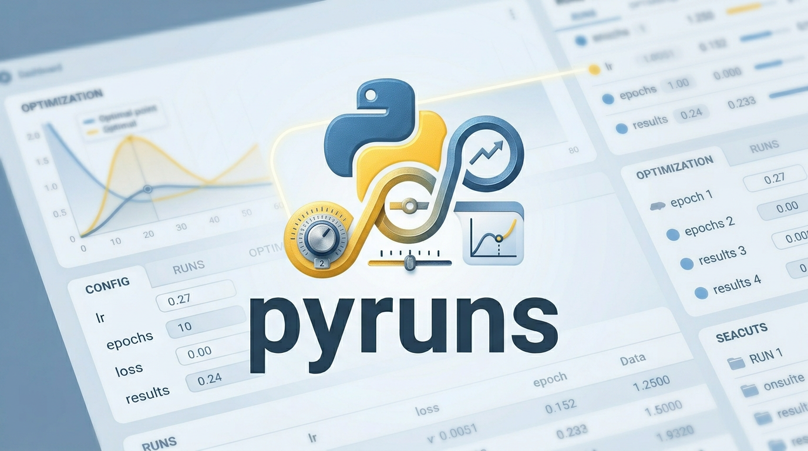

# pyruns



> 一个面向本地实验与脚本任务管理的轻量工具：参数生成、批量任务、原生 shell 任务、实时日志、任务检索、指标导出，全部围绕磁盘工作区展开。

## 项目定位

Pyruns 现在的主链路是：

- 前端：React，源码在 [`frontend/`](frontend)
- 后端：FastAPI，接口与运行时在 [`pyruns/web/`](pyruns/web)
- 核心逻辑：任务生成、任务管理、执行器、系统指标在 [`pyruns/core/`](pyruns/core)
- 工具层：settings、log I/O、workspace/task 文件结构、排序与过滤在 [`pyruns/utils/`](pyruns/utils)
- 前端构建产物：打包到 [`pyruns/web/static/`](pyruns/web/static)，这样整个 UI 可以直接随 `pyruns` 使用

Pyruns 不是一个远程 SaaS，也不是云端实验平台。它的设计目标很明确：

- 直接在你当前机器上工作
- 尽量复用你已经在用的脚本、环境变量、conda 环境和 shell
- 用磁盘目录把任务状态、配置、日志和记录稳定落盘
- 让 React UI 成为当前主入口

## 当前核心能力

### 1. Script Workspace

对普通 Python 脚本工作区，Pyruns 会围绕脚本创建一个独立 workspace：

```text
your_project/
├─ train.py
└─ _pyruns_/
   ├─ _pyruns_settings.yaml
   └─ train/
      ├─ script_info.json
      ├─ config_default.yaml
      └─ tasks/
```

在这个工作区里：

- `Generator` 支持 `form` / `yaml`
- `task_kind = "config"`
- 每个任务保存自己的 `config.yaml`
- 执行时会注入 `__PYRUNS_CONFIG__`
- 适合 `argparse` 或 `pyruns.load()` 风格脚本

### 2. Shell Workspace

Pyruns 也支持共享的 shell 工作区：

```text
your_project/
└─ _pyruns_/
   └─ _shell_/
      ├─ script_info.json
      └─ tasks/
```

在这个工作区里：

- `Generator` 固定为 `shell`
- `task_kind = "shell"`
- 每个任务保存为 `config.sh`
- 不注入 `__PYRUNS_CONFIG__`
- 任务正文就是要执行的命令文本

最重要的语义是：

- 默认 `shell_mode: follow`
- 也就是 shell 任务会尽量等价于“在启动 `pyr` 的那个终端里，再手动执行一次同样的命令”
- 当前 Python 进程环境会继续继承给子进程，所以 conda、PATH、用户环境变量会一起继承
- 不做跨 shell 语法翻译

这意味着：

- Windows 下如果你是从 PowerShell 启动 `pyr`，shell task 默认按 PowerShell 语义执行
- Windows 下如果你是从 cmd 启动 `pyr`，shell task 默认按 cmd 语义执行
- Linux / macOS 默认跟随启动 `pyr` 的当前 shell
- 只有显式把 `_pyruns_settings.yaml` 里的 `shell_mode` 改成 `custom`，才会启用 `shell_executable`

## 页面说明

### Home / Dashboard

- 展示任务摘要
- 展示 CPU、RAM、GPU 状态
- GPU 卡片现在会显示利用率、显存占用/总量
- 点击 GPU 卡片可以查看对应 GPU 的进程占用明细
- 刷新节奏跟随 `header_refresh_interval`

### Generator

- Script workspace 下支持 `form` / `yaml`
- Shell workspace 下支持 `shell`
- 支持 batch 语法
- 支持 pinned 参数
- 现在会直接展示当前 shell runtime 信息，帮助确认 follow/custom 状态

### Manager

- 搜索、过滤、分页、批量运行、批量删除
- pinned tasks 单独展示
- 任务卡片支持直接运行、查看日志、删除
- 搜索框支持多行输入，换行按 AND 语义过滤

### Monitor

- xterm.js 实时查看日志
- 支持历史 log 文件切换
- 支持导出多任务日志
- 现在切换任务时会更严格地隔离 websocket 流，避免把别的任务日志串进来
- 直接从侧边栏点进 `Monitor` 时默认不自动选任务；只有从任务入口显式跳转时才会带着选中项进入

## 快速开始

### 安装

```bash
pip install pyruns
```

### 打开一个脚本工作区

```bash
pyr train.py
```

如果你有现成模板：

```bash
pyr train.py config_default.yaml
```

### 打开 shell 工作区

先打开一个普通脚本工作区，然后在左侧切到 `Open Shell Mode`。

生成的 shell 任务会落到：

```text
<project>/_pyruns_/_shell_/tasks/<task_name>/config.sh
```

## `_pyruns_settings.yaml`

工作区设置文件位于：

```text
<project>/_pyruns_/_pyruns_settings.yaml
```

当前比较重要的键：

| 键 | 说明 |
| --- | --- |
| `ui_port` | Web UI 端口 |
| `header_refresh_interval` | Dashboard/Header 刷新间隔，单位秒 |
| `generator_form_columns` | Generator 表单列数 |
| `manager_columns` | Manager 卡片列数 |
| `manager_max_workers` | 批量运行最大 worker 数 |
| `manager_execution_mode` | `thread` 或 `process` |
| `monitor_chunk_size` | Monitor 单次日志块大小 |
| `monitor_scrollback` | Monitor 最大历史滚动行数 |
| `monitor_sidebar_width_pct` | Monitor 左侧任务栏宽度百分比 |
| `shell_mode` | `follow` 或 `custom` |
| `shell_executable` | 仅当 `shell_mode: custom` 时生效 |

推荐理解方式：

- 默认保持 `shell_mode: follow`
- 只有你明确需要固定某个 shell 路径时，才设置 `custom`

## 开发说明

### 前端开发

```bash
cd frontend
npm install
npm run dev
```

### 前端打包到 Python 包

```bash
cd frontend
npm run build
```

构建结果会写入：

```text
pyruns/web/static/
```

### 运行测试

```bash
pytest -q
```

## 推荐继续阅读

- [快速开始](docs/getting-started.md)
- [配置说明](docs/configuration.md)
- [架构说明](docs/architecture.md)
- [UI 指南](docs/ui-guide.md)
- [批量语法](docs/batch-syntax.md)
- [CLI 指南](docs/cli-guide.md)

## License

MIT
