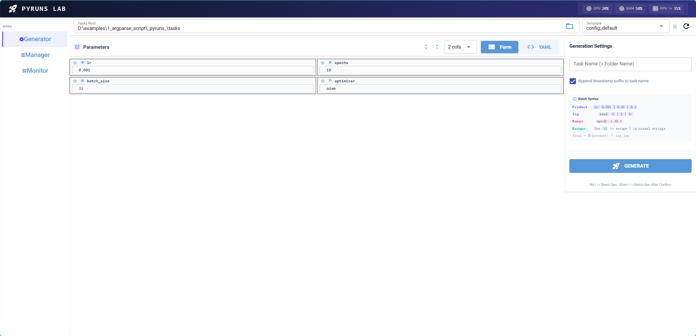
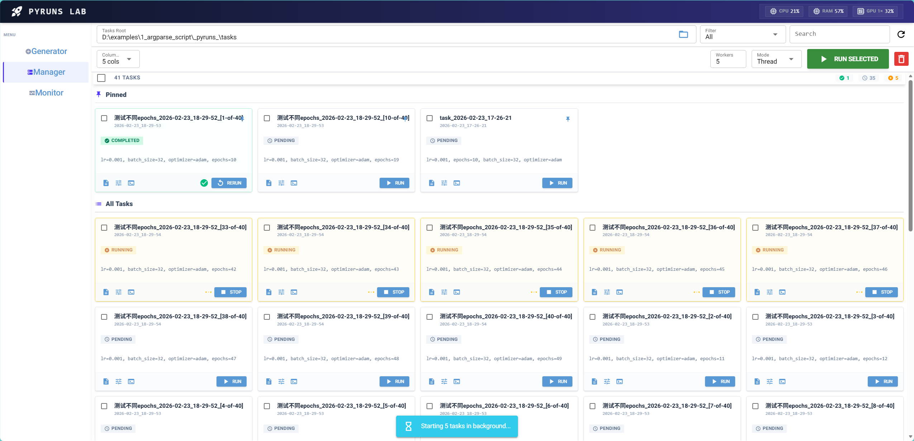
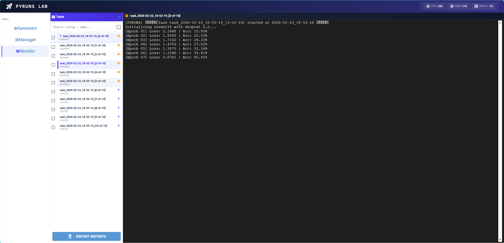

# 安装与快速开始

## 系统要求

| 项目 | 要求 |
|------|------|
| Python | ≥ 3.8 |
| 操作系统 | Windows / Linux / macOS |
| GPU 监控 | NVIDIA GPU + `nvidia-smi`（可选） |

## 安装

### 从源码安装（开发模式）

```bash
git clone <repo-url>
cd pyruns
pip install -e .
```

### 依赖包

核心依赖（自动安装）：

| 包 | 用途 |
|----|------|
| `nicegui` | Web UI 框架（基于 FastAPI + Vue/Quasar） |
| `pyyaml` | YAML 配置文件解析 |
| `psutil` | CPU / RAM 系统指标采集 |

可选依赖：

| 包 | 用途 |
|----|------|
| `nvidia-smi` | GPU 利用率和显存监控（需 NVIDIA 驱动） |
| `tkinter` | 文件夹选择对话框（通常随 Python 安装） |

## 快速开始

### 方式一：CLI 模式（推荐）

```bash
# 模式 1：零配置启动 (自动解析您的 Argparse 脚本构建 UI)
pyr your_script.py

# 模式 2：导入自定义 YAML 配置启动 (将 YAML 作为当前脚本的默认配置)
pyr your_script.py my_config.yaml
```

`pyr` 命令会自动完成以下步骤：

1. **检测参数来源**
   - 如果脚本使用 `argparse`：通过 AST 解析提取所有 `add_argument()` 参数
   - 如果脚本调用 `pyruns.read()`：使用指定的或默认的配置文件

2. **生成默认配置**
   - 在脚本所在目录创建 `_pyruns_/config_default.yaml`
   - 包含所有参数的默认值和注释

3. **启动 Web UI**
   - 终端会自动打开浏览器，或手动访问 `http://localhost:8099`

### 方式二：手动配置模式 (Manual Config)
如果您的脚本没有使用 `argparse`，或者您希望显式控制配置：

1. **导入现有配置**：
   ```bash
   pyr train.py my_settings.yaml
   ```
   该 YAML 会被复制到任务根目录作为默认配置。

2. **在脚本中加载**：
   ```python
   import pyruns
   config = pyruns.load()  # 自动加载 UI 中配置好的参数
   ```

### 方式三：极简开发模式 (Dev Mode)
```bash
pyr dev your_script.py
```
开启热重载（Edit & See），实时响应脚本变化。

---

## 第一个实验

### 1. 创建实验脚本

```python
# train.py
import argparse

parser = argparse.ArgumentParser()
parser.add_argument("--lr", type=float, default=0.001, help="学习率")
parser.add_argument("--epochs", type=int, default=10, help="训练轮数")
parser.add_argument("--batch_size", type=int, default=32, help="批大小")
args = parser.parse_args()

for epoch in range(args.epochs):
    print(f"Epoch {epoch+1}/{args.epochs}, lr={args.lr}, bs={args.batch_size}")
```

### 2. 启动 Pyruns

```bash
pyr train.py
```

### 3. 在 Generator 页面调参



- 修改参数值（如 `lr: 0.01`）
- 输入任务名称（如 `baseline`）
- 点击 **GENERATE** 生成任务

### 4. 在 Manager 页面运行

- 勾选目标任务
- 点击 **RUN SELECTED**
- 观察任务状态从 `pending` → `queued` → `running` → `completed`



### 5. 在 Monitor 页面查看日志

- 选择左侧任务列表中的任务
- 实时查看彩色日志输出
- 日志自动滚动到底部



## 目录结构

运行 `pyr train.py` 后生成的文件结构：

```text
your_project/
├── train.py                          # 你的脚本
└── _pyruns_/                         # 工作区根目录
    ├── config_default.yaml           # 自动生成的默认配置
    ├── _pyruns_settings.yaml         # GUI 设置文件
    └── tasks/                        # 任务根目录
        ├── baseline/                 # 具体任务目录
        │   ├── task_info.json        # 任务元数据（状态、时间、PID）
        │   ├── config.yaml           # 此任务的参数快照
        │   └── run.log               # 运行日志
        ├── baseline-[1-of-3]/        # 批量任务
        │   ├── ...
        └── .trash/                   # 软删除的任务
```

## 环境变量

| 变量 | 说明 | 设置者 |
|------|------|--------|
| `PYRUNS_ROOT` | 任务存储根目录 | 用户 / `pyr` CLI |
| `PYRUNS_CONFIG` | 当前任务的 `config.yaml` 路径 | `pyr` 运行器（自动） |
| `PYRUNS_SCRIPT` | 用户脚本路径 | `pyr` CLI（自动） |

## 下一步

- [UI 使用指南](ui-guide.md) — 三个页面的详细操作说明
- [批量生成语法](batch-syntax.md) — Product / Zip 语法详解
- [API 参考](api-reference.md) — `pyruns.read()` / `pyruns.load()` / `pyruns.add_monitor()` 详细文档

