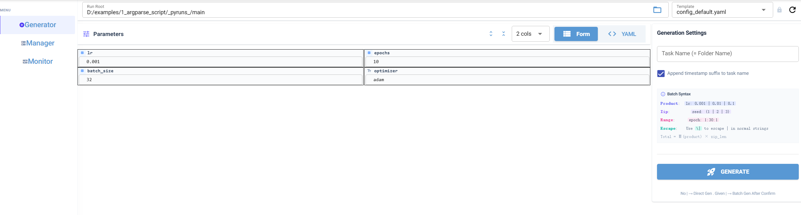
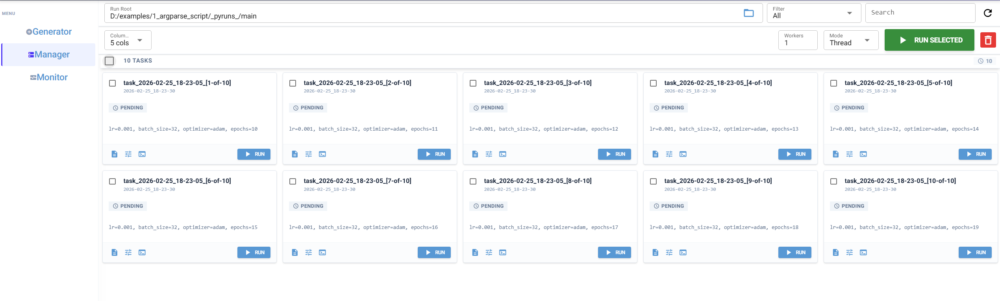
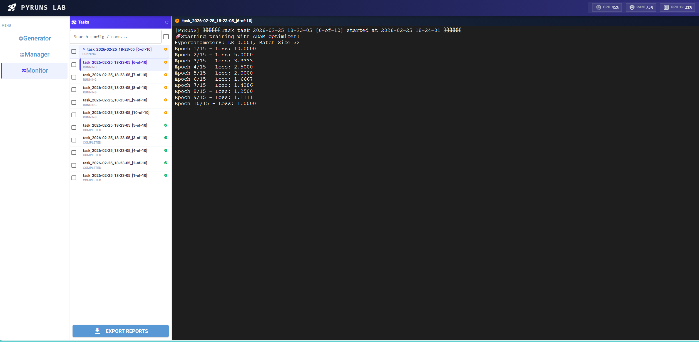

# 🖥️ UI 界面全景操作指南

通过 `pyr train.py` 启动服务后，整个应用由顶部全局指标看板和三大核心功能页签组成。无需繁重的学习，本指南将带你快速解锁所有进阶操作。

---

## 📈 顶部系统看板 (Global System Header)

无论你在哪个页面，顶部的控制台始终实时汇报你机器的健康状况（每 3 秒刷新）：

```text
[CPU 45%]  [RAM 68%]  [G0 85% 8192/24576M]  [G1 12% 1024/24576M]
```

- **CPU & RAM**: 物理机的整体资源使用率快照。
- **GPU (Gn)**: 智能识别环境中的所有 NVIDIA 显卡。

---

## ⚙️ 页面一：Generator (配置生成器)

**核心功能：在此页面配置参数并生成批量任务。**



### 1. 结构化表单 vs. 源码编辑

在左侧 `Template` 下拉框选中基础配置后，你可以随意横跳于两种编辑模式：

- 📝 **Form 视图（图形化编辑）**
  - **动态排版**：支持按需调整 1~9 列的表单流式布局，紧凑的空间利用率。
  - **嵌套折叠**：字典类型的配置会自动展示为可折叠面板，便于管理复杂嵌套参数。
  - **图钉**：针对高频修改的超参数，点击右上角的 `pin` 即可置顶显示。

- 📜 **YAML 视图（源码级控制）**
  - 内置基于 CodeMirror 的高亮编辑器。
  - 对于极其复杂的修改（或粘贴外部配置），你可以直接手写原生 YAML。

### 2. 批量生成语法

直接在编辑框内使用特定语法，即可快速实现大批量的网格搜索配置（详情参阅 [批量语法章节](batch-syntax.md)）。

- **排列组合 (Product)** 使用 `|`
  - 示例: `batch_size`: `32 | 64 | 128` 自动派生 3 个独立任务
- **关联打包 (Zip)** 使用 `(|)`
  - 示例: `model_name`: `(ResNet | VGG)` 与 `lr`: `(0.1 | 0.01)` 配对组合，派生 2 个任务

配置完成后，输入基础任务名称前缀，点击底部 **GENERATE** 按钮，系统即会为您在后台批量生成相应的任务记录。

---

## 🗂️ 页面二：Manager (任务总控台)

**核心功能：以直观的卡片网格形式管理、筛选并批量运行实验任务。**



### 1. 任务列表与过滤查询

本区域集中展示了当前脚本空间内的所有任务。

- **状态过滤**：通过顶栏状态按钮快速筛选 `Pending` (待运行), `Running` (运行中), `Completed` (已完成) 或 `Failed` (失败)。
- **模糊搜索**：支持根据任务名称关键字检索。
- **自定义视图**：可自由调节卡片流的展示列数（支持 1-9 列）。

### 2. 并发执行与模式选择

Manager 页面的右上角提供了对并发执行的精细控制：

- **Workers (最大并发数)**：指定允许同时执行的脚本实例最大数量。
- **Execution Mode (执行模式)**:
  - `Thread`（多线程模式）：适用于需要共享父进程空间或资源消耗较小的脚本，是默认推荐选项。
  - `Process`（多进程模式）：进程级别隔离，适用于 CPU 密集型或遇到 Python GIL 瓶颈的任务。

在列表中批量选中任务后，点击 **RUN SELECTED** 按钮即可调度执行。

### 3. 任务详细信息 (Task Details Dialog)

点击任意状态的任务卡片，将弹出查看详情的对话窗口（支持鼠标拖拽）：

| 标签页 | 说明 |
|--------|----------|
| **Task Info** | `task_info.json` 的只读视图。包含任务创建时间、执行耗时、PID 及历史重跑 (Rerun) 次数。 |
| **Config** | `config.yaml` 的只读视图。展示该任务启动时被注入的具体参数配置。 |
| **Run Log** | 终端输出阅读器。可选择查看当前或过往执行的日志（如 `run.log`, `rerun1.log` 等）。 |
| **Notes** | 富文本便笺，支持随时保存对该次实验的自定义备注。 |
| **Env Vars** | 任务启动瞬间所捕获的系统环境变量，便于追溯底层运行环境。 |

---

## 📊 页面三：Monitor (日志追踪与报表)

**核心功能：以流式终端界面监控输出，并提供统一的评估指标导出。**



### 1. 流式终端 (Streaming Terminal Log)

对正在执行 (`Running`) 的任务，Monitor 提供实时的跟踪视图：

- **ANSI 颜色支持**：完美支持 `tqdm` 等进度条与 `colorama` 色彩的网页解析渲染。
- **无感增量抓取**：基于偏移量（offset）对日志文件进行块级增量读取（read chunk），避免反复拉取大文件的网络堵塞。
- **Auto-Scroll 功能**：开启后，终端内容将自动追踪至最新的输出行。

### 2. 导出报告 (Export Reports)

还记得 `pyruns.add_monitor()` 吗？如果你在代码终点打下了这个桩：

```python
pyruns.add_monitor(loss=curr_loss, auc=curr_auc)
```

1. 在 Monitor 页面左侧勾选相应的历史实验。
2. 点击页面下方的 **Export Reports** 按钮。
3. 可选择导出为 **CSV 或 JSON** 格式的汇总报表，用于二次分析或作图展示。

---

## ⌨️ 进阶功能与状态说明

- **软删除设计 (`.trash`)**
  在界面中执行的任务删除操作为软删除。被剔除的任务文件夹会被移动至工作区根目录下的 `.trash/` 文件夹中，支持人工后期手动审查或恢复。

- **任务运行状态流转**
  - 灰色 ⏰ `Pending`：等待被操作调度
  - 蓝色 ⏳ `Queued`：已加入 Workers 池，等待系统资源分配
  - 琥珀色 ▶ `Running`：子进程正在执行
  - 绿色 ✓ `Completed`：执行结束并成功退出（Exit Code: 0）
  - 红色 ✗ `Failed`：执行过程出现异常或报错崩溃（Exit Code: >0）

